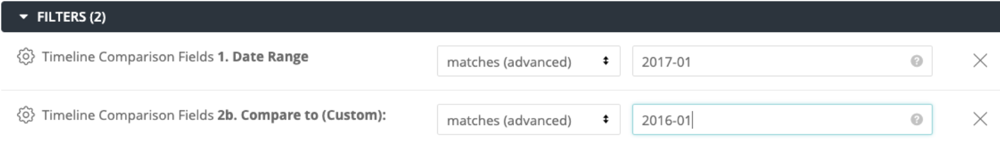
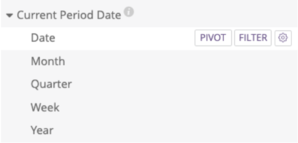
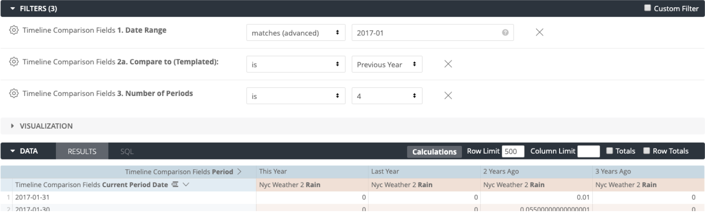

# Date Comparison Block

## What is this block?
This block allows for comparisons from one date period to another, or from one date period to a number of periods. It provides extensive flexibility in comparing date ranges, and presenting these back as a single visualisation.

## Motivation
There are already a few blocks that allow for comparison between periods in Looker. The motivation for this block was to combine all the elements from the other blocks in a way that is intuitive, flexible and fast to use.

## Solution
The approach was to use the intuitive style of date comparison that is used in Google Analytics - where the basic idea is that you choose the current date range that you’re interested in, then choose the comparison date range in the past. There are some templated period filters to make this easy for the user, but also custom filters to allow flexibility in comparing dates.
The features are:

1. **Templated comparison periods** - Once the initial period of interest is chosen, rather than manually choose the period before, there is a range of options presented such as “Previous Period”, “Previous Month”, “Previous Year” etc

2. **Custom comparison periods** - in the situation where any of the above don’t fit what you are trying to see, then a custom previous date range may be chosen

3. **Any granularity** - Choose how granular you want your results to be by picking the appropriate date dimension from the dimension group

4. **Multiple periods** - Choose the number of periods you would like to compare, this is only available for templated periods, e.g January this year vs January last year vs January 2 years ago etc.

## How to use
The process for using this in your explore is as follows:

1. Add the filter `Date Range` to choose your initial date range
2. Add the filter `Compare To (Templated)` to choose a templated comparison range
**OR**
Add the filter `Compare To (Custom)` to choose a custom comparison range
4. If you have chosen a templated range, you may choose to add more periods by using the `Comparison Periods` filter
5. Choose your date dimension - only pick from the dimension group `Current Period Date`, don’t use any date dimension from any other view
6. Choose your other dimensions and measures as usual
7. Finally, pivot on `Period`
8. Hit run

## How to implement
Syntax assumes a BigQuery connection, you may need to adjust this for other database connections.
To have this available to use in your explores and dashboards there are a few steps:

1. Copy the view file `_date_comparison.view.lkml` into your project
2. In the view file where the date dimension you would like to be able to compare is, extend the `_date_comparison` view by adding the parameter `extends: [_date_comparison]`
3. In the same view file, add two new dimensions, `event_date` and `event_raw`. These are simply `<your_date_dimension>_date` and `<your_date_dimension>_raw` respectively. This step is just so that naming convention used in the `_date_comparison` view works correctly
3. In the relevant explore LookML, add in the `sql_always_where` clause defined in the model file here. Replace all instances of `<your_view_name>` with your view name.

## Trouble Shooting

If you have you connection set up to a timezone and time selected e.g. UTC, US Central Time, Looker will pass additional arguements into the SQL which will error with the existing code. This is due to the use of the Date_sub function.
The following error will occur:
`No matching signature for function FORMAT_TIMESTAMP for argument types: STRING, DATE, STRING. Supported signature: FORMAT_TIMESTAMP(STRING, TIMESTAMP, [STRING]) at`

A fix is being worked on for this bug
